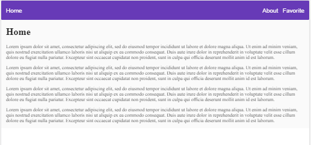
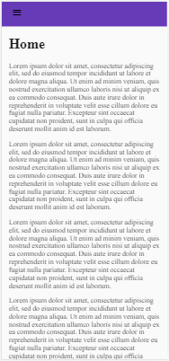
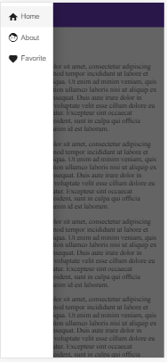

# NavComponent

This library was generated with [Angular CLI](https://github.com/angular/angular-cli) version 7.2.0.

It contains a navigation component with routing capability and a responsive behavior.

On screens higher than 649px, the navigation will display all the headers:

On screens smalled than 650px, the navigation will display a hamburger icon where the user can click on it and see the navigation options on a side navigation component.

 

